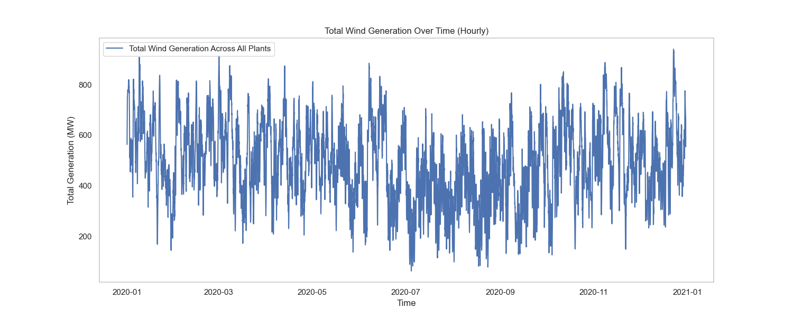

# Wind Generation Dataset Exploration and Analysis

Welcome to the wind generation dataset analysis project! This repository contains a series of data exploration, descriptive analysis, and visualization techniques applied to the 2020 wind generation dataset. This project aims to uncover patterns in hourly wind generation across multiple wind plants and analyze their geographical distribution.

## Overview
The primary objective of this project is to explore the wind generation dataset, which includes hourly generation data across 1,395 wind plants throughout the year 2020. Each plant’s data is analyzed to understand trends over time, geographical distribution, and correlation across different plants. This project is an introduction to data science methods applied to renewable energy time series data.

### Key Components
- **Data Preprocessing**: Initial data inspection, basic statistics, and feature engineering to prepare the dataset for analysis.
- **Data Visualization**: Comprehensive visualizations that include total generation over time, top locations by state, correlation analysis, and more.
  
## Running the Code

The main code for this analysis is stored in the script file **`analysis.py`**. This script can be run in any Python environment where all required libraries (`pandas`, `numpy`, `matplotlib`, `seaborn`) are installed.

### Steps to Run
1. Clone the repository to your local machine and ensure that all dependencies are installed.
2. Run the script directly with Python to generate and save each plot in the `output_plots` directory:
   ```bash
   python3 preprocess.py
   ```
3. After running, all plots will be saved as images in the `output_plots` folder for easy access and further analysis.

## Visualizations

The following visualizations are generated as part of this project to provide insights into the wind generation data:

### Wind Plant Locations by State
This scatter plot shows the geographical distribution of wind plants by state based on latitude and longitude coordinates.

<div align="center">
  
</div>

### Top 5 States by Number of Wind Plants
This bar plot illustrates the top 5 states with the highest number of wind plants, showcasing areas with significant wind energy infrastructure.

<div align="center">
  
</div>

### Total Wind Generation Over Time (Hourly)
This line plot displays the total wind generation across all plants over each hour in 2020, providing a continuous view of wind energy production patterns.

<div align="center">
  
</div>

### Daily and Monthly Average Generation
This plot shows both daily and monthly average wind generation across all plants, allowing us to observe seasonal trends in wind energy production.

<div align="center">
  
</div>

### Correlation Between Plants
This heatmap visualizes the correlation between wind generation outputs across different plants, revealing plants with similar generation patterns.

<div align="center">
  
</div>

### Average Generation by Hour of Day (Diurnal Pattern)
This line plot illustrates the average wind generation by hour across all plants, highlighting any daily generation patterns, such as peak generation hours.

<div align="center">
  
</div>

## Dataset
The wind generation dataset provides hourly wind generation measurements for 1,395 wind plants across the year 2020. Each plant's data is represented as a separate column, with rows representing each hour of the year. This dataset enables analysis of generation patterns, both temporal (hourly, daily, monthly) and spatial (across states).

| **Variable**       | **Description**                                                        |
|--------------------|------------------------------------------------------------------------|
| Date/Time          | Hourly timestamp for each measurement                                  |
| Plant1, Plant2, ..., Plant1395 | Hourly wind generation (MW) for each plant                 |

For more detailed information, please refer to the dataset documentation.

